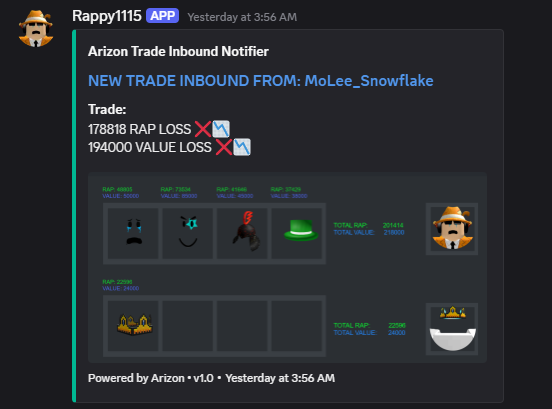
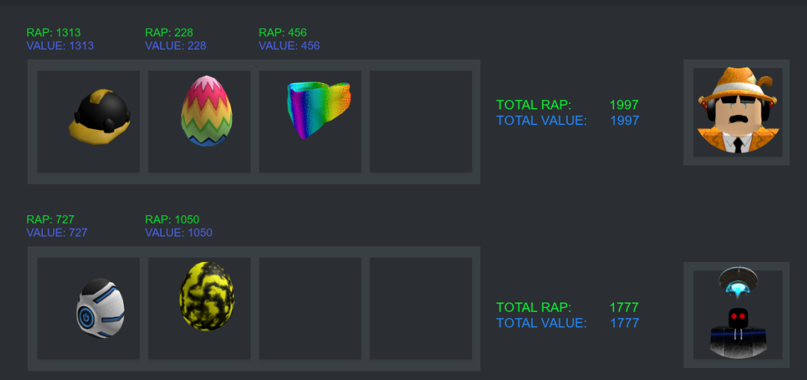

# Arizon-Trade AD

A **Discord notifier and trade analyzer** for Roblox item trading.  
This bot sends real-time inbound trade notifications to your Discord server, including detailed RAP and value comparisons, powered by **Node.js**, **discord.py**, and **REST APIs**.


(Built for stakeholders that the Roblox Community requested)

---

## 🚀 Features

- 📡 **Real-time Trade Notifications** – Instant alerts for inbound trades  
- 📊 **RAP & Value Calculations** – Automatic profit/loss detection  
- 🖼 **Trade Preview with Images** – Item icons displayed in rich embeds  
- 🤖 **Discord Bot Integration** – Fully automated in your server  

<br></br>


<p><strong>Trade Inbound Example:<strong></p>


<br></br>

<p><strong>Trade Comparison Example:<strong></p>


---

## 🛠️ Built With

- **Node.js** – Core trade handling  
- **discord.py** – Discord embeds & notifications  
- **REST APIs** – Fetch Roblox item/market data  

---

## ⚙️ Configuration

### 1. `.env`

Store your private keys and tokens here:

```env
DISCORD_TOKEN=your_discord_bot_token
```

### 2. `config.json`

Configure the config.json to your roblox account:
```
{
     "Trade_Inbounds": true,
     "roblox_id": 123456789,
     "RoliVerification": "REPLACE-WITH-YOUR-ROLIMONS-VERIFICATION",
     "RobloxSecurity": "REPLACE-WITH-YOUR-ROBLOX-COOKIES",
     "items_send": [
          123456789,
          123456789
     ],
     "items_request": [
        16899436
     ],
     "tags_send": [
          "rap",
          "demand",
          "adds"
     ],
     "tags_available": [
          "adds",
          "upgrade",
          "downgrade",
          "any",
          "wishlist",
          "demand",
          "rares",
          "rap",
          "robux",
          "projecteds"
     ],
     "robux_send": 250

}
```


--- 

## ⚡ Running the Bot


1. Clone the repository:
   ```bash
   git clone https://github.com/michmich242/Arizon-TradeAd.git
   cd into Arizon-TradeAd (Go inside that folder)
   ```

2. Install Dependencies in the project directory:
   ```bash
   npm install
   ```

3. Start the bot!
   ```bash
   npm start
   ```


